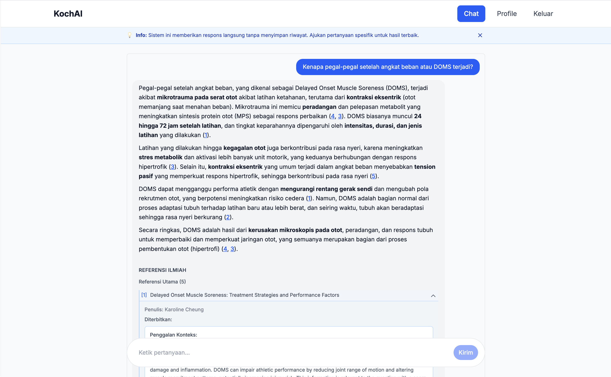

# KochAI

Frontend for **KochAI**, an AI-powered fitness assistant backed by a scientific knowledge base (PaperQA on the API). Users sign in, complete onboarding, and chat with cited answers from research papers.



## Features

- **RAG chat** — Ask fitness questions; responses include scientific references and expandable citations
- **Vanilla mode** — Optional direct LLM replies without the knowledge base (toggle in chat)
- **Auth** — Register, login, JWT session in `localStorage`, protected routes
- **Onboarding** — Profile and fitness preferences before chat access
- **Profile** — Update account details and preferences
- **Responsive UI** — Tailwind CSS v4, light/dark-friendly layout

## Tech stack

| Layer | Choice |
| --- | --- |
| Framework | React 19, React Router 7 (SSR) |
| Language | TypeScript |
| Styling | Tailwind CSS 4 |
| Build | Vite 6 |
| API client | `app/services/fitness-api.ts` (OpenAPI-aligned) |

## Prerequisites

- **Node.js** 20+ (Dockerfile uses Node 20)
- **pnpm** recommended (`pnpm-lock.yaml` in repo), or npm
- **Backend API** — KochAI RAG service (PaperQA); default dev URL `http://localhost:8000`

## Quick start

```bash
pnpm install
# create .env with VITE_API_BASE_URL (see Environment)
pnpm dev
```

App runs at [http://localhost:5173](http://localhost:5173).

### Environment

Create a `.env` file in the project root:

```env
VITE_API_BASE_URL=http://localhost:8000
```

If unset, the client falls back to `http://localhost:8000`. For a deployed API, set this at **build time** (Vite embeds `VITE_*` variables).

## Routes

| Path | Purpose |
| --- | --- |
| `/` | Login and registration |
| `/home` | Landing page; redirects authenticated users to chat or onboarding |
| `/onboarding` | Profile + fitness preferences (required for new users) |
| `/chat` | Main chat (protected) |
| `/profile` | Account and preferences (protected) |

**Typical flow:** `/` → authenticate → `/onboarding` (if incomplete) → `/chat`.

## Scripts

| Command | Description |
| --- | --- |
| `pnpm dev` | Dev server with HMR |
| `pnpm build` | Production build (`build/client`, `build/server`) |
| `pnpm start` | Serve production build |
| `pnpm typecheck` | React Router typegen + `tsc` |

## Project layout

```
app/
├── components/     # Auth, onboarding, navigation, protected route
├── contexts/       # AuthContext
├── routes/         # Route modules (home, chat, profile, …)
├── services/       # fitness-api.ts — HTTP client for backend
└── root.tsx        # App shell
```

API client details, auth flow, and endpoint coverage: **[README-API.md](./README-API.md)**.

## Production build

```bash
pnpm build
pnpm start
```

SSR is enabled (`react-router.config.ts`). Deploy the `build/` output and run `react-router-serve` (see `pnpm start`).

## Docker

```bash
docker build -t kochai-fe .
docker run -p 3000:3000 kochai-fe
```

The image runs `npm run start` on port 3000. Set `VITE_API_BASE_URL` during the image **build** stage if the API URL is not localhost.

> **Note:** The Dockerfile expects `package-lock.json`. This repo uses pnpm; for Docker builds you may need to generate a lockfile or adjust the Dockerfile to use `pnpm-lock.yaml`.

## Related repos

- **This repo:** `kochai-fe` — web UI
- **Backend / RAG API:** configure via `VITE_API_BASE_URL`

---

Built with React Router 7.
